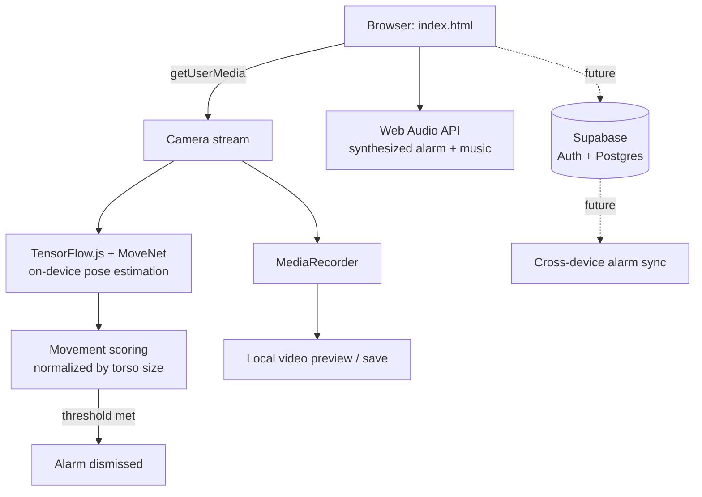

# Wake & Move

An alarm clock that won't stop ringing until you get up and prove it — on camera, in real time — by moving.

> Built to solve a very specific problem: snoozing. The alarm only turns off once on-device pose detection confirms you've been moving continuously for a few seconds. No moving, no silence.

**Live demo:** _add your Netlify URL here once deployed_
**Demo video:** _add a short screen recording / GIF here_

---

## Why this exists

Traditional alarms rely on willpower at the exact moment willpower is lowest. This project removes the choice: the alarm is physically tied to a real, camera-verified action, not a button tap.

## Features

- **iOS-style alarm management** — multiple alarms, labels, custom synthesized sounds, enable/disable toggles
- **On-device pose detection** — MoveNet (TensorFlow.js) tracks 17 body keypoints in real time through the browser, entirely client-side
- **Movement verification, not fixed choreography** — any sufficiently large, continuous movement counts, normalized against body scale so it works at any distance from the camera
- **Motion-sensor handoff** — the ringing screen watches the device's accelerometer and automatically advances to the move-challenge once it detects you've picked up the phone
- **Video capture + preview** — the whole challenge is recorded locally via `MediaRecorder`; you can preview, save, or retake before dismissing
- **Procedurally generated audio** — both the alarm tones and the background music during the challenge are synthesized in real time with the Web Audio API — no licensed or external audio files
- **Installable PWA** — has a manifest, service worker, and app icons; can be added to a phone's home screen and opens full-screen like a native app
- **Optional AI coach** — bring your own Anthropic or OpenAI API key and the "Congratulations!" line after each challenge is written live by an LLM instead of picked from a fixed list, personalized to how long the challenge took and which difficulty/music you chose

## Tech stack

| Layer | Choice | Why |
|---|---|---|
| Frontend | Vanilla HTML/CSS/JS | No build step, keeps the project approachable and easy to deploy as a static site |
| ML inference | TensorFlow.js + MoveNet (`@tensorflow-models/pose-detection`) | Runs fully in-browser via WebGL — no video ever leaves the device |
| Audio | Web Audio API | Alarm tones and background music are synthesized (oscillators + envelopes), avoiding any copyright/licensing concerns |
| Media capture | `MediaRecorder` + `getUserMedia` | Native browser APIs, no extra dependencies |
| Backend *(planned, deferred)* | [Supabase](https://supabase.com) (Postgres + Auth) | Backend-as-a-service — gives real user accounts and a relational database without hosting/maintaining a server. Schema is designed; wiring it up was deprioritized under a tight build timeline in favor of a working local-first version. |
| Hosting | Netlify / Vercel | Free static hosting with HTTPS (required for camera access) and auto-deploy from GitHub |

## Architecture



Everything left of the dotted line runs today, fully client-side, with zero backend calls. The dotted portion (Supabase) is the planned next step for account-based sync — schema is already drafted in `supabase/schema.sql`.

## Where generative AI fits in this project

It's worth being precise about this, since it's easy to wave "AI" around without saying which kind: the pose-detection model (MoveNet) is a **discriminative** model — given an image, it predicts where 17 joints are. It doesn't generate anything new. Generative AI shows up in this project in two distinct places:

1. **The build process itself.** This project was built through AI-assisted ("vibe coding") development — see the note below.
2. **The AI coach feature.** After each completed challenge, an LLM (Claude or GPT, your choice) is prompted with how long the challenge took, the difficulty, and the music genre, and writes a one-off congratulatory line in response — this is a live text-generation call, not a lookup. It's opt-in and requires the person's own API key (see the in-app Settings screen for the security tradeoffs of calling a provider directly from the browser, and why a real product would proxy this through a backend instead).

Both are genuinely different from the perception task the camera is doing, and the app is designed so it's obvious which is which.

## Technical highlights

A few decisions worth calling out beyond "it uses API X":

- **Scale-invariant movement scoring** — rather than raw pixel displacement, movement is measured as average keypoint displacement *normalized by torso length* (shoulder-to-hip distance). Without this, the same physical movement registers as a bigger signal when close to the camera than far away, making a single threshold unusable.
- **Frame-rate-independent progress accumulation** — progress fills based on elapsed wall-clock time (`dt`) rather than a fixed per-frame increment, with `dt` clamped to avoid a huge jump if the tab was backgrounded and `requestAnimationFrame` paused.
- **Cross-platform motion-permission handling** — iOS 13+ requires an explicit user gesture to grant `DeviceMotionEvent` access; other platforms don't. The code branches on `typeof DeviceMotionEvent.requestPermission` and falls back to a manual "I'm up" button everywhere else, so the feature degrades gracefully instead of breaking silently.
- **Manual resource cleanup** — recorded video Blob URLs are explicitly revoked (`URL.revokeObjectURL`) and camera tracks explicitly stopped (`track.stop()`) once no longer needed, to avoid memory leaks and a camera indicator light that never turns off.
- **Security-conscious schema design (planned)** — the Supabase schema uses Postgres Row Level Security so each user's data is isolated at the database layer, not just hidden in the UI — meaning the public "anon" API key is safe to ship in client-side code by design.

## Project structure

```
wake-and-move/
├── index.html          the app (alarm list, editor, ringing, dance challenge, preview)
├── manifest.json        PWA manifest (name, icons, launch behavior)
├── sw.js                 service worker (offline app-shell caching)
├── icons/                app icons, generated at several sizes
├── supabase/
│   └── schema.sql        database schema for the planned backend (alarms, sessions, RLS policies)
├── config.example.js      template for Supabase project keys — copy to config.js and fill in your own
└── README.md
```

## Running it locally

Service workers and camera access require `http://` or `https://` — opening the file directly (`file://`) won't work.

```bash
# from inside the project folder, either of these works:
npx serve .
# or
python3 -m http.server 8080
```

Then open the printed `localhost` address in your browser.

## Deployment

Static site, no build step. Connect this GitHub repo to [Netlify](https://netlify.com) or [Vercel](https://vercel.com) and it deploys automatically on every push.

## Roadmap

- [x] Local persistence (`localStorage`) so alarms survive a page refresh
- [ ] Supabase Auth + alarm sync across devices — schema is drafted (`supabase/schema.sql`), deliberately deferred: given a tight build timeline, shipping a working local-first version took priority over account infrastructure that isn't needed to validate the core idea
- [ ] Wrap with [Capacitor](https://capacitorjs.com) for a native iOS/Android build — solves the core reliability gap of browser tabs being suspended in the background, so the alarm fires even if the app isn't open
- [ ] Self-host the pose-detection model weights for full offline support
- [ ] Basic anti-cheat: liveness check to prevent looping a pre-recorded video in front of the camera

## A note on how this was built

This project was built with AI-assisted ("vibe coding") development: architecture, UX, and product decisions were directed by me, with an AI assistant (Claude) writing and iterating on the implementation based on my feedback and testing. I've documented the reasoning behind the non-obvious technical choices above because understanding *why* a decision was made — not just being able to type the code — is what I think actually matters when working this way.

## License

MIT — see [LICENSE](LICENSE).
