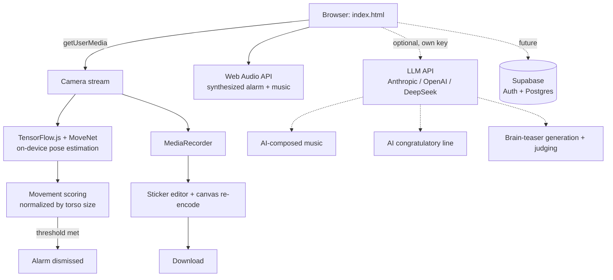

# Wake & Move

An alarm clock that won't stop ringing until you get up and prove it — on camera, in real time — by moving.

**Live demo:** _add your Netlify URL here once deployed_
**Demo video:** _add a short screen recording / GIF here_

---

## Why this exists

Traditional alarms rely on willpower at the exact moment willpower is lowest. This one ties dismissal to a real, camera-verified action instead of a button tap.

## Features

- **Animated intro screen** — an original SVG illustration (bed + a bouncing figure) and a rotating headline
- **iOS-style alarm management** — multiple alarms, labels, custom synthesized sounds, enable/disable toggles
- **Configurable difficulty per alarm** — Easy / Medium / Hard sets both move duration (5 / 8 / 10s) and brain-teaser count (1 / 3 / 5)
- **Selectable music genre** — Energetic, Lyrical, Playful, or Retro
- **On-device pose detection** — MoveNet (TensorFlow.js) tracks 17 body keypoints in real time, entirely client-side
- **Movement verification, not fixed choreography** — any large, continuous movement counts, normalized against body scale so it works at any distance from the camera
- **Motion-sensor handoff** — the ringing screen watches the accelerometer and auto-advances once you pick up the phone
- **Brain-teaser alternative** — solve AI-generated riddles/arithmetic instead of dancing; a second LLM call judges typed answers, tolerant of phrasing and typos
- **Video capture + sticker editor** — records locally via `MediaRecorder`; drag emoji stickers onto the clip (some auto-follow your eyes/nose/head via the same pose model), then download with everything baked in via canvas re-encoding — no server involved
- **Procedurally generated audio** — alarm tones and music are synthesized live with the Web Audio API, no external audio files
- **Installable PWA** — manifest + service worker + icons; adds to a phone's home screen like a native app
- **Optional AI coach & composer** — add your own Anthropic, OpenAI, or DeepSeek API key in Settings and the congratulatory line, some background music, and scrolling hype comments during the challenge all get generated live. No key, no problem — everything falls back to built-in lines and tracks.

## Tech stack

| Layer | Choice | Why |
|---|---|---|
| Frontend | Vanilla HTML/CSS/JS | No build step, easy to deploy as a static site |
| ML inference | TensorFlow.js + MoveNet | Runs fully in-browser via WebGL — no video leaves the device |
| Audio | Web Audio API | Tones and music synthesized live — no licensing concerns |
| Media capture | `MediaRecorder` + `getUserMedia` | Native browser APIs, no extra dependencies |
| Backend *(planned, deferred)* | [Supabase](https://supabase.com) (Postgres + Auth) | Schema is designed (`supabase/schema.sql`); deprioritized in favor of shipping a working local-first version first |
| Hosting | Netlify | Free HTTPS (required for camera access) and auto-deploy from GitHub |

## Architecture



Everything except the two dotted branches runs today, fully client-side. The LLM branch is opt-in (needs a key entered in Settings); Supabase is the planned next step for account-based sync.

## Where generative AI fits

Worth being precise: the pose-detection model (MoveNet) is **discriminative** — it locates 17 joints, it doesn't generate anything. Generative AI shows up in four places instead:

1. **The brain-teaser alternative** — plays to an LLM's actual strength (open-ended language understanding), not audio generation. One call writes a riddle, a second judges the typed answer, tolerant of phrasing and typos in a way a hardcoded string match never could be.
2. **Scrolling hype comments** — a batch of short one-liners generated once at the start of each dance attempt (not per-line, since a 5-10s challenge is often over before a single round trip returns).
3. **AI-composed music** — the app already had a working procedural music engine (a 16-step Web Audio sequencer). An LLM can be asked to compose a new track as JSON, which is validated field-by-field (frequency ranges, oscillator types, array lengths) before it's trusted, same as any untrusted third-party input.
4. **The AI coach's line** — the most decorative one: an LLM writes a one-off congratulatory line after each completed challenge.

All four are opt-in and require an API key entered in Settings (Anthropic, OpenAI, or DeepSeek) — see that screen for the tradeoffs of calling a provider directly from the browser.

## Technical highlights

- **Baking stickers into a downloadable video without a server** — each frame is drawn onto a `<canvas>` alongside sticker positions, captured as a `MediaStream` via `canvas.captureStream()`, and recorded in real time with a second `MediaRecorder`. Also corrects for the live preview's CSS mirroring, which the underlying decoded frames don't have.
- **Repurposing a body-pose model as an approximate face tracker** — the face-following stickers reuse the same MoveNet detector rather than a dedicated face-landmark model, extrapolating position/scale from eye-to-eye distance. An honest approximation, not pixel-perfect tracking, and the UI says so.
- **Scale-invariant movement scoring** — movement is keypoint displacement normalized by torso length, so the same physical movement doesn't register differently at different distances from the camera.
- **Frame-rate-independent progress** — fills based on elapsed wall-clock time rather than a fixed per-frame increment, clamped to avoid a jump if the tab was backgrounded.
- **Cross-platform motion-permission handling** — iOS 13+ requires a user gesture to grant `DeviceMotionEvent` access; the code branches accordingly and falls back to a manual button everywhere else.

## Project structure

```
wake-and-move/
├── index.html          the app
├── manifest.json        PWA manifest
├── sw.js                 service worker (offline app-shell caching)
├── icons/                app icons
├── netlify.toml           points Netlify at the function below
├── netlify/functions/
│   └── ai-proxy.js        optional shared-key proxy (see Deployment)
├── supabase/schema.sql   database schema for the planned backend
├── config.example.js      template for Supabase project keys
└── README.md
```

## Running it locally

Service workers and camera access require `http://` or `https://` — `file://` won't work.

```bash
npx serve .
# or
python3 -m http.server 8080
```

Then open the printed `localhost` address.

## Deployment

Static site, no build step. Connect this GitHub repo to [Netlify](https://netlify.com) for auto-deploy on every push.

For the AI features, the supported path is entering your own API key in the app's Settings screen. There's also an optional serverless proxy (`netlify/functions/ai-proxy.js`) for sharing one key across everyone who visits the site without their own — set an API key as a Netlify environment variable and redeploy. This is unverified in production and not required; bring-your-own-key is the primary path.

## Roadmap

- [x] Local persistence (`localStorage`) so alarms survive a page refresh
- [ ] Supabase Auth + alarm sync across devices — schema drafted, deferred in favor of a working local-first version first
- [ ] Wrap with [Capacitor](https://capacitorjs.com) for a native iOS/Android build, so the alarm fires even if the app isn't open
- [ ] Self-host the pose-detection model weights for full offline support
- [ ] Basic anti-cheat: liveness check to prevent looping a pre-recorded video in front of the camera

## License

MIT — see [LICENSE](LICENSE).
