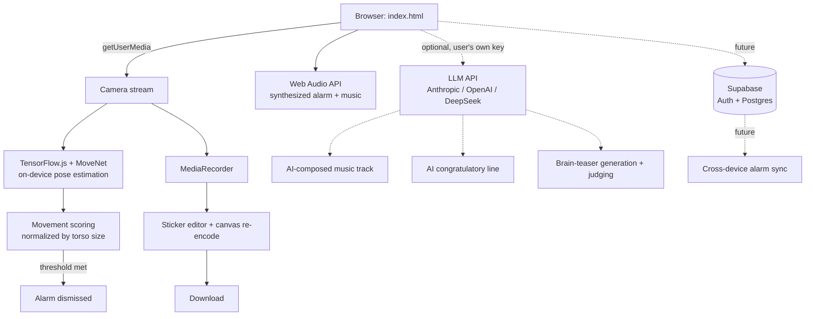

# Wake & Move

An alarm clock that won't stop ringing until you get up and prove it — on camera, in real time — by moving.

> Built to solve a very specific problem: snoozing. The alarm only turns off once on-device pose detection confirms you've been moving continuously for a few seconds. No moving, no silence.

**Live demo:** _add your Netlify URL here once deployed_
**Demo video:** _add a short screen recording / GIF here_

---

## Why this exists

Traditional alarms rely on willpower at the exact moment willpower is lowest. This project removes the choice: the alarm is physically tied to a real, camera-verified action, not a button tap.

## Features

- **Animated intro screen** — an original illustration (bed + a bouncing figure, hand-drawn in SVG) and a rotating headline before you ever set an alarm
- **iOS-style alarm management** — multiple alarms, labels, custom synthesized sounds, enable/disable toggles
- **Configurable difficulty per alarm** — Easy / Medium / Hard controls both how long you need to move (5 / 8 / 10 seconds) and how many brain teasers you need to solve back-to-back (1 / 3 / 5) if you take that path instead
- **Selectable music genre** — Energetic, Lyrical, Playful, or Retro; the move-challenge picks a track to match
- **On-device pose detection** — MoveNet (TensorFlow.js) tracks 17 body keypoints in real time through the browser, entirely client-side
- **Movement verification, not fixed choreography** — any sufficiently large, continuous movement counts, normalized against body scale so it works at any distance from the camera
- **Motion-sensor handoff** — the ringing screen watches the device's accelerometer and automatically advances to the move-challenge once it detects you've picked up the phone
- **Brain-teaser alternative** — don't want the camera on? Solve AI-generated brain teasers instead (a mix of lateral-thinking riddles and simple arithmetic), with a second LLM call judging each typed answer, tolerant of phrasing, typos, and synonyms rather than an exact string match
- **Video capture + sticker editor** — the whole challenge is recorded locally via `MediaRecorder`; afterward you can drag emoji stickers onto the clip, including several that automatically follow your eyes/nose or sit on top of your head (reusing the same MoveNet pose model from recording, rather than a separate face-landmark model), then download a new file with everything baked in — composited frame-by-frame onto a canvas and re-encoded client-side, no server involved
- **Procedurally generated audio** — both the alarm tones and the background music during the challenge are synthesized in real time with the Web Audio API — no licensed or external audio files
- **Installable PWA** — has a manifest, service worker, and app icons; can be added to a phone's home screen and opens full-screen like a native app
- **Optional AI coach & composer** — bring your own Anthropic, OpenAI, or DeepSeek API key and three things become dynamic: the "Congratulations!" line is written live by an LLM personalized to how the alarm was dismissed, the move-challenge music sometimes gets a freshly AI-composed 16-step track (in the exact JSON shape the existing Web Audio sequencer already knows how to play) instead of one of the five built-in tracks, and scrolling danmaku-style hype comments fly across the screen during the dance challenge, generated as a batch at the start of each attempt. If you don't have your own key, the app tries a shared demo key configured server-side (see `netlify/functions/ai-proxy.js`) before falling back to the built-in lines and tracks — nothing ever breaks.

## Tech stack

| Layer | Choice | Why |
|---|---|---|
| Frontend | Vanilla HTML/CSS/JS | No build step, keeps the project approachable and easy to deploy as a static site |
| ML inference | TensorFlow.js + MoveNet (`@tensorflow-models/pose-detection`) | Runs fully in-browser via WebGL — no video ever leaves the device |
| Audio | Web Audio API | Alarm tones and background music are synthesized (oscillators + envelopes), avoiding any copyright/licensing concerns |
| Media capture | `MediaRecorder` + `getUserMedia` | Native browser APIs, no extra dependencies |
| Backend *(planned, deferred)* | [Supabase](https://supabase.com) (Postgres + Auth) | Backend-as-a-service — gives real user accounts and a relational database without hosting/maintaining a server. Schema is designed; wiring it up was deprioritized under a tight build timeline in favor of a working local-first version. |
| Hosting | Netlify / Vercel | Free static hosting with HTTPS (required for camera access) and auto-deploy from GitHub |

## Architecture



Everything except the two dotted branches runs today, fully client-side. The LLM branch is live but opt-in (needs a key entered in Settings); the Supabase branch is the planned next step for account-based sync — schema is already drafted in `supabase/schema.sql`.

## Where generative AI fits in this project

It's worth being precise about this, since it's easy to wave "AI" around without saying which kind: the pose-detection model (MoveNet) is a **discriminative** model — given an image, it predicts where 17 joints are. It doesn't generate anything new. Generative AI shows up in this project in five distinct places:

1. **The build process itself.** This project was built through AI-assisted ("vibe coding") development — see the note below.
2. **The brain-teaser alternative.** This is the use case that plays most directly to an LLM's actual strength: understanding open-ended language, not generating audio. One call writes a riddle; a second call reads back whatever the person typed and judges whether it counts as correct, tolerant of phrasing, typos, and synonyms — something a hardcoded string match could never do. This was chosen deliberately over routes (like calling a music-generation API for audio) that ask a language model to do something closer to a different model family's job.
3. **Scrolling hype comments during the dance challenge.** A batch of short, funny one-liners is generated at the start of each attempt and streamed across the screen like danmaku comments, so a 5-10 second challenge doesn't feel like standing in front of a silent camera. This is another good fit for an LLM — short creative copywriting — and it's fetched as one batch up front rather than one call per line, since the whole challenge is often over before a single round trip would return.
4. **AI-composed music.** The move-challenge already had a fully working procedural music engine — a 16-step sequencer synthesizing kicks, bass, and lead lines with the Web Audio API. Rather than always picking between five hand-written tracks, an LLM can be asked to *compose* a new one: it returns a JSON object in the exact shape the sequencer expects, which is then validated field-by-field — clamped frequency ranges, whitelisted oscillator types, checked array lengths — before it's trusted, the same way you'd treat any untrusted input from a third party. If it comes back malformed, or there's no key configured, the app silently keeps playing one of the built-in tracks.
5. **The AI coach's congratulatory line.** The most decorative of the five — after each completed challenge (whichever path was used), an LLM is prompted with how it was solved and writes a one-off congratulatory line in response.

(2) through (5) are all opt-in and require the person's own API key for one of three providers (Anthropic, OpenAI, or DeepSeek — see the in-app Settings screen for the security tradeoffs of calling a provider directly from the browser, and why a real product would proxy this through a backend instead).

## Technical highlights

A few decisions worth calling out beyond "it uses API X":

- **Baking stickers into a downloadable video without a server.** There's no video-editing library or backend here — stickers are composited by drawing each video frame onto a `<canvas>` alongside the sticker positions, capturing that canvas as a live `MediaStream` via `canvas.captureStream()`, and recording *that* with a second `MediaRecorder` in real time as the clip plays through once. It also corrects for a subtlety: the live preview is CSS-mirrored for a natural selfie view, but the underlying decoded video frames aren't — so the canvas draw step re-applies that mirror so the downloaded file matches what was actually seen on screen.
- **Repurposing a body-pose model as an approximate face tracker.** The "follow the face" stickers (sunglasses, disguise, crown, halo, top hat) don't use a dedicated face-landmark model — they reuse the same MoveNet detector already loaded for the move challenge, which only exposes single points for each eye and the nose (no jaw, no face outline, no rotation, and no head-top point at all — that one's extrapolated from eye spacing). Sticker position and scale are derived from eye-to-eye distance; this is an honest approximation, not pixel-perfect tracking, and the in-app copy says so rather than overselling it. Positions persist across any single frame where a face isn't detected, so a brief tracking miss doesn't make a sticker jump.

- **Scale-invariant movement scoring** — rather than raw pixel displacement, movement is measured as average keypoint displacement *normalized by torso length* (shoulder-to-hip distance). Without this, the same physical movement registers as a bigger signal when close to the camera than far away, making a single threshold unusable.
- **Frame-rate-independent progress accumulation** — progress fills based on elapsed wall-clock time (`dt`) rather than a fixed per-frame increment, with `dt` clamped to avoid a huge jump if the tab was backgrounded and `requestAnimationFrame` paused.
- **Cross-platform motion-permission handling** — iOS 13+ requires an explicit user gesture to grant `DeviceMotionEvent` access; other platforms don't. The code branches on `typeof DeviceMotionEvent.requestPermission` and falls back to a manual "I'm up" button everywhere else, so the feature degrades gracefully instead of breaking silently.
- **Manual resource cleanup** — recorded video Blob URLs are explicitly revoked (`URL.revokeObjectURL`) and camera tracks explicitly stopped (`track.stop()`) once no longer needed, to avoid memory leaks and a camera indicator light that never turns off.
- **Security-conscious schema design (planned)** — the Supabase schema uses Postgres Row Level Security so each user's data is isolated at the database layer, not just hidden in the UI — meaning the public "anon" API key is safe to ship in client-side code by design.

## Project structure

```
wake-and-move/
├── index.html          the app (alarm list, editor, ringing, dance challenge, preview)
├── manifest.json        PWA manifest (name, icons, launch behavior)
├── sw.js                 service worker (offline app-shell caching)
├── icons/                app icons, generated at several sizes
├── netlify.toml           tells Netlify where to find the serverless function below
├── netlify/
│   └── functions/
│       └── ai-proxy.js    optional shared-key proxy for the AI features (see Deployment)
├── supabase/
│   └── schema.sql        database schema for the planned backend (alarms, sessions, RLS policies)
├── config.example.js      template for Supabase project keys — copy to config.js and fill in your own
└── README.md
```

## Running it locally

Service workers and camera access require `http://` or `https://` — opening the file directly (`file://`) won't work.

```bash
# from inside the project folder, either of these works:
npx serve .
# or
python3 -m http.server 8080
```

Then open the printed `localhost` address in your browser.

## Deployment

Static site, no build step. Connect this GitHub repo to [Netlify](https://netlify.com) and it deploys automatically on every push — Netlify also picks up `netlify/functions/` automatically thanks to `netlify.toml`, so the serverless proxy deploys alongside the static files with no extra steps. (Vercel works for the static site too, but the function would need to be ported to Vercel's function format.)

### Optional: shared AI key (so visitors without their own key still get the AI features)

1. In the Netlify dashboard: **Site settings → Environment variables → Add a variable**
2. Add `ANTHROPIC_API_KEY` (or `OPENAI_API_KEY` / `DEEPSEEK_API_KEY`) with your real key as the value
3. If not using Anthropic, also set `AI_PROXY_PROVIDER` to `openai` or `deepseek`
4. Redeploy (environment variable changes only take effect on the next deploy)

The key only ever lives in Netlify's environment — never in this repo, never sent to the browser. See the comments at the top of `netlify/functions/ai-proxy.js` for the full explanation, including the cost/abuse tradeoff of sharing one key across every visitor.

## Roadmap

- [x] Local persistence (`localStorage`) so alarms survive a page refresh
- [ ] Supabase Auth + alarm sync across devices — schema is drafted (`supabase/schema.sql`), deliberately deferred: given a tight build timeline, shipping a working local-first version took priority over account infrastructure that isn't needed to validate the core idea
- [ ] Wrap with [Capacitor](https://capacitorjs.com) for a native iOS/Android build — solves the core reliability gap of browser tabs being suspended in the background, so the alarm fires even if the app isn't open
- [ ] Self-host the pose-detection model weights for full offline support
- [ ] Basic anti-cheat: liveness check to prevent looping a pre-recorded video in front of the camera

## A note on how this was built

This project was built with AI-assisted ("vibe coding") development: architecture, UX, and product decisions were directed by me, with an AI assistant (Claude) writing and iterating on the implementation based on my feedback and testing. I've documented the reasoning behind the non-obvious technical choices above because understanding *why* a decision was made — not just being able to type the code — is what I think actually matters when working this way.

## License

MIT — see [LICENSE](LICENSE).
